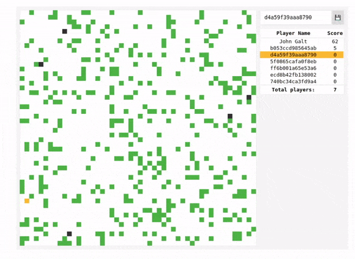

multiplayer-game-swoole-websocket
===================================

An extremely simple multiplayer game, created with the Swoole + WebSocket API

## Preview


## Trying
```sh
git clone https://github.com/gustavonovaes/multiplayer-game-swoole-websocket.git
cd multiplayer-game-swoole-websocket
docker-compose up
```

Then access [http://127.0.0.1:8080](http://127.0.0.1:8080)


## Why
I'm doing a personal challenge, which is to create 10 projects, proposed by Felipe Deschamps in [this video](https://www.youtube.com/watch?v=fYR9L2ZmodM).

This is the "Catalog Page" project.

- Rich-text editor
- Monitor-like Activity Monitor from macOS
- Apple Music or Spotify app
- Calendar
- Show and filters repository on Github
- [x] [Something that uses external API](https://gustavonovaes.github.io/breaking-bad-cast/)
- [x] [Catalog page](https://github.com/gustavonovaes/microsoft-official-page-clone)
- E-commerce
- Your own portifolio
- [x] [Create your own multiplayer game](https://github.com/gustavonovaes/multiplayer-game-swoole-websocket)
